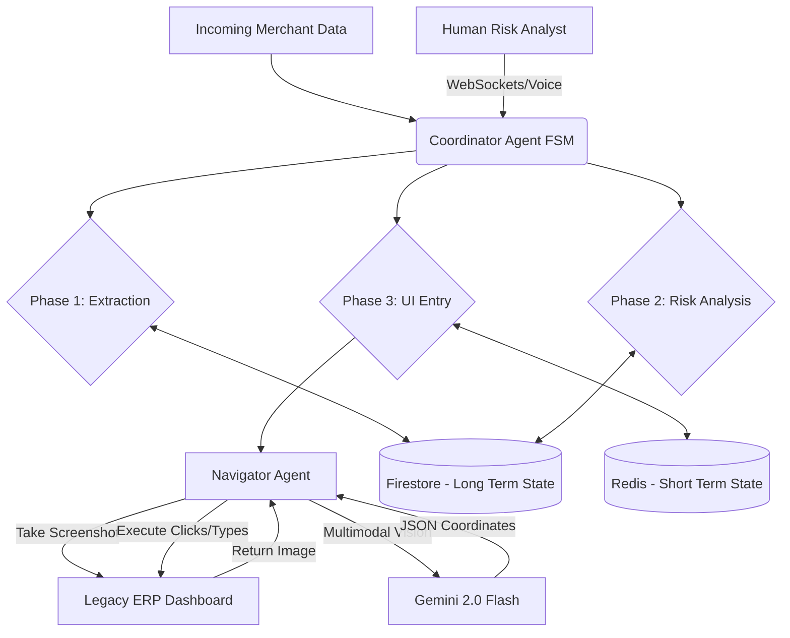

# Project Synapse: System Architecture

## Overview
Project Synapse is an autonomous Merchant Onboarding Bridge. It safely bridges the gap between modern API-driven workflows (like document parsing and risk analysis) and legacy, non-API systems (like old ERP dashboards) using purely agentic vision and direct simulated interaction.

## Core Components
The system is built on a $0 cost architecture utilizing Google Cloud ecosystem features.

### 1. The Brain (Coordinator Agent)
*   **Role**: Orchestrates the workflow using an asynchronous Finite State Machine (FSM).
*   **Phases**:
    1.  **Document Data Extraction**: Parses incoming merchant PDFs/forms.
    2.  **Risk Analysis**: Evaluates merchant data against standardized risk parameters.
    3.  **UI Form Entry (Delegation)**: Instructs the Navigator agent to input the verified data into the legacy ERP.
*   **Tech**: Python, `asyncio`, Google Cloud Run.

### 2. The Eyes & Hands (Navigator Agent)
*   **Role**: A specialized multimodal agent that interprets pixel data from the browser to interact with non-API systems.
*   **Function**: Receives a screenshot and DOM state of the legacy ERP (e.g., `mock_erp.html`). It uses Gemini 2.0 Flash Vision capabilities to identify the exact bounding boxes of buttons and text fields, returning actionable JSON coordinates for clicking and typing.
*   **Tech**: Gemini 2.0 Flash (via `google-genai` SDK).

### 3. The Memory (State Management)
To ensure long-running onboarding forms don't lose data and intermediate states are captured:
*   **Short-Term Memory**: High-speed, ephemeral state during active interactions. Uses **Upstash Serverless Redis** (or an in-memory python dictionary if running locally).
*   **Long-Term Memory**: Stores the authoritative "Process State" spanning multiple days or disconnected phases. Uses **Google Cloud Firestore**.

### 4. The Voice (Human-in-the-Loop)
*   **Role**: Integration with Gemini Live via WebSockets.
*   **Function**: Allows real-time voice interruptions (Barge-in) from human risk analysts reviewing the automated form entry before final submission.

## Architecture and Data Flow

## Security & Cost Controls
*   **Zero-Dollar Alert**: A `budget_alert.yaml` is configured via Google Cloud Pub/Sub to instantly revoke IAM Invoker access to Cloud Run if billing exceeds $0.00.
*   **Secrets**: All API keys are managed centrally, avoiding hardcoded values in the container.
